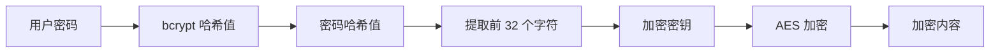

This blog template is built with [Astro](https://astro.build/). For the things that are not mentioned in this guide, you may find the answers in the [Astro Docs](https://docs.astro.build/).

## Front-matter of Posts

```yaml
---
title: 我的第一篇博客文章
published: 2025-12-01
description: 这是我的新天文博客的第一篇文章。
image: ./cover.jpg
tags: [Foo, Bar]
category: Front-end
draft: false
---
```


| Attribute     | Description                                                                                                                                                                                                 |
|---------------|-------------------------------------------------------------------------------------------------------------------------------------------------------------------------------------------------------------|
| `title`       | 文章标题是：                                                                                                                                                                                      |
| `published`   | 帖子发布日期。                                                                                                                                                                          |
| `pinned`      | 此帖是否置顶于帖子列表顶部。                                                                                                                                                   |
| `description` | 文章简介，显示在首页。                                                                                                                                                  |
| `image`       | 文章封面图片的路径。<br/>1. 以 `http://` 或 `https://` 开头：使用网页图片<br/>2. 从 `/` 开始：对于 `public` 目录中的图像<br/>3. 不使用任何前缀：相对于 Markdown 文件 |
| `tags`        | 帖子的标签。                                                                                                                                                                                    |
| `category`    | 帖子类别。                                                                                                                                                                                  |
| `permalink`   | 自定义文章永久链接。文章将可通过 `/posts/{permalink}/` 访问。例如：`my-special-article`（可通过 `/posts/my-special-article/` 访问）。                                   |
| `licenseName` | 帖子内容的许可证名称。                                                                                                                                                                     |
| `author`      | 帖子作者。                                                                                                                                                                                     |
| `sourceLink`  | 文章内容的来源链接或参考资料。                                                                                                                                                         |
| `draft`       | 如果这篇文章仍是草稿，则不会显示。                                                                                                                                                |

## 帖子文件存放位置


您的文章文件应放置在 `src/content/posts/` 目录下。您还可以创建子目录，以便更好地组织您的文章和资源。

```
src/content/posts/
├── post-1.md
└── post-2/
    ├── cover.png
    └── index.md
```

## 自定义永久链接

你可以通过在文章的 front matter 中添加 `permalink` 字段来为任何文章设置自定义永久链接：

```yaml
---
title: My Special Article
published: 2024-01-15
permalink: "my-special-article"
tags: ["Example"]
category: "Technology"
---
```

设置自定义永久链接后：

- 文章将可通过自定义 URL 访问（例如，`/posts/my-special-article/`）
- 默认 URL `/posts/{slug}/` 仍然有效
- RSS/Atom 源将使用自定义永久链接
- 所有内部链接将自动使用自定义永久链接

**重要提示：**
- 永久链接不应包含 `/posts/` 前缀（系统会自动添加）
- 永久链接中请勿使用特殊字符和空格
- 为获得最佳 SEO 效果，请使用小写字母和连字符
- 确保所有文章的永久链接均不相同
- 请勿在永久链接前或后添加斜杠

## 工作原理


