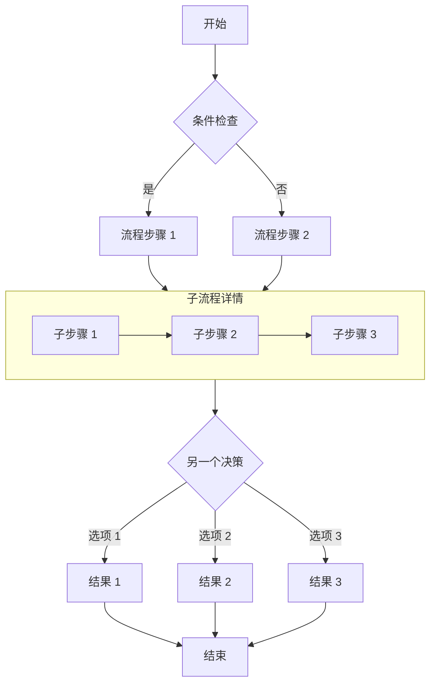
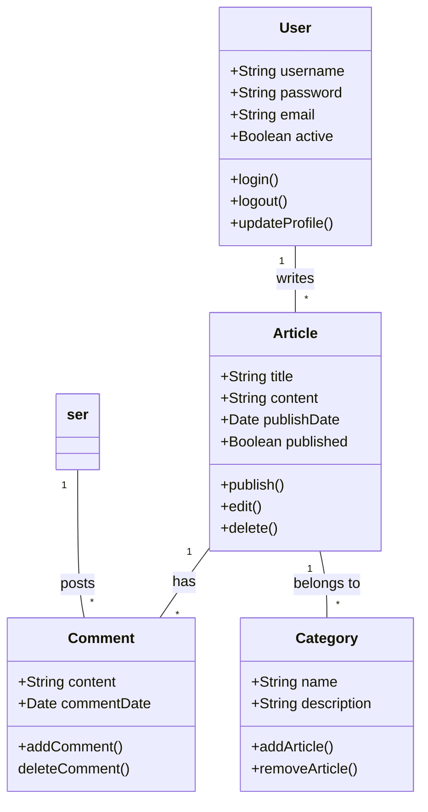

# 使用 Mermaid Diagrams 绘制 Markdown 图表的完整指南

本文演示了如何使用 Mermaid 在 Markdown 文档中创建各种复杂的图表，包括流程图、序列图、甘特图、类图和状态图。

## 流程图示例

流程图非常适合表示流程或算法步骤。



## 序列图示例

序列图展示了对象之间随时间推移的交互。

```mermaid
sequenceDiagram
	参与者 用户
	参与者 Web 应用
	参与者 服务器
	参与者 数据库
	
	用户->>Web 应用：提交登录请求
	Web 应用->>服务器：发送身份验证请求
	服务器->>数据库：查询用户凭据
	数据库-->>服务器：返回用户数据
	服务器-->>Web 应用：返回身份验证结果
	
	alt 身份验证成功
		Web 应用->>用户：显示欢迎页面
		Web 应用->>服务器：请求用户数据
		服务器->>数据库：获取用户偏好设置
		数据库-->>服务器：返回偏好设置
		服务器-->>Web 应用：返回用户数据
		Web 应用->>用户：加载个性化界面
	else 身份验证失败
		Web 应用->>用户：显示错误信息
		Web 应用->>用户：提示重新输入
	end
```

## 甘特图示例

甘特图非常适合用来展示项目进度和时间线。

```mermaid
甘特图
	标题：网站开发项目时间表
	期格式：YYYY-MM-DD
	坐标轴格式：%m/%d

	章节：设计阶段
	需求分析：a1，2023-10-01，7天
	用户界面设计：a2，a1之后，10天
	原型创建：a3，a2之后，5天
	
	章节：开发阶段
	前端开发：b1，2023-10-20，15天
	后端开发：b2，a2之后，18天
	数据库设计：b3，a1之后，12天

	章节：测试阶段
	单元测试：c1，b1之后，8天
	成测试：c2，b2之后，10天
	用户验收测试：c3，c2之后，7天

	章节：部署
	产环境部署：d1，c3之后，3天
	上线：里程碑在 d1 和 0d 之后

```

## 类图示例

类图展示了系统的静态结构，包括类、属性、方法及其相互关系。



## 状态图示例

状态图展示了对象在其生命周期中所经历的状态序列。

```mermaid
stateDiagram-v2
	[*] --> 草稿
	
	草稿 --> 审核中：提交
	审核中 --> 草稿：拒绝
	核中 --> 已批准：批准
	已批准 --> 已发布：发布
	已发布 --> 已存档：存档
	已发布 --> 草稿：撤回

	状态：已发布 {
		[*] --> 启用
		启用 --> 隐藏：暂时隐藏
		隐藏 --> 启用：恢复
		启用 --> [*]
		隐藏 --> [*]
}

	已存档 --> [*]
```

## 饼图示例

饼图非常适合显示比例和百分比数据。

```美人鱼派标题 网站流量来源分析
	“搜索引擎”：45.6
	“直接访问”：30.1
	“社交媒体”：15.3
	“推荐链接”：6.4
	其他来源”：2.6
```

## 结论

Mermaid 是一款功能强大的工具，可用于在 Markdown 文档中创建各种类型的图表。本文演示了如何使用流程图、序列图、甘特图、类图、状态图和饼图。这些图表可以帮助您更清晰地表达复杂的概念、流程和数据结构。

要使用 Mermaid，只需在代码块中指定 Mermaid 语言，并使用简洁的文本语法描述图表即可。Mermaid 会自动将这些描述转换为美观的可视化图表。

不妨在您的下一篇技术博客文章或项目文档中使用 Mermaid 图表——它们会让您的内容更专业、更易于理解！